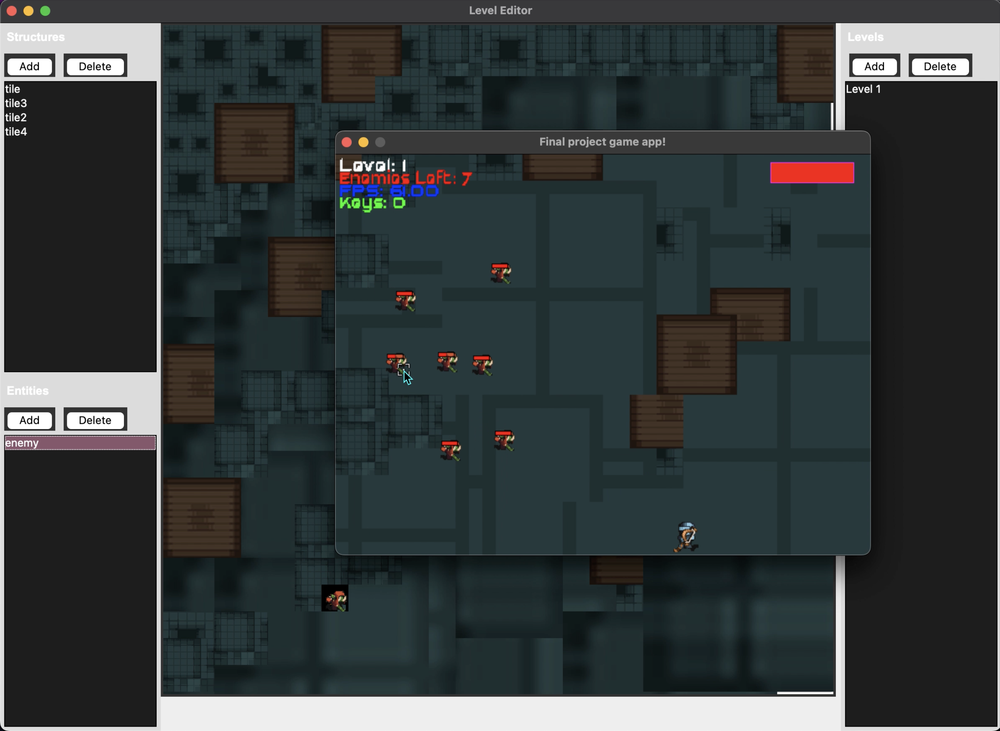
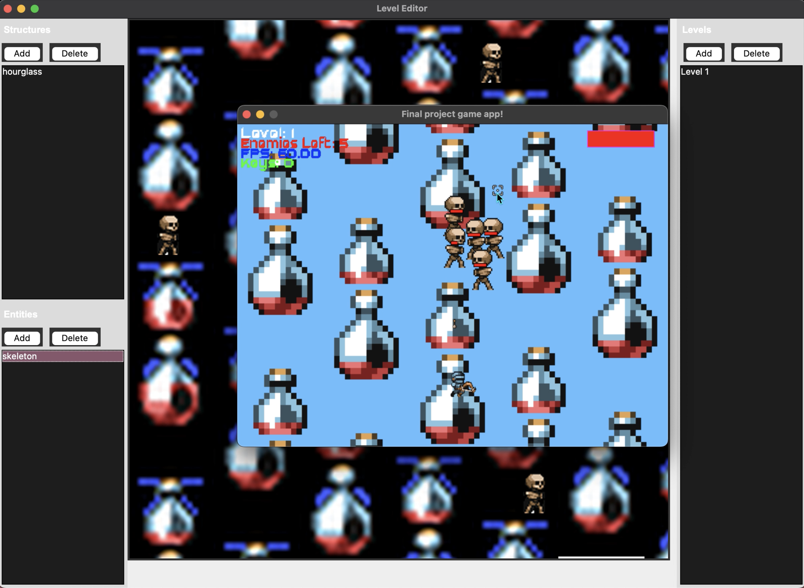
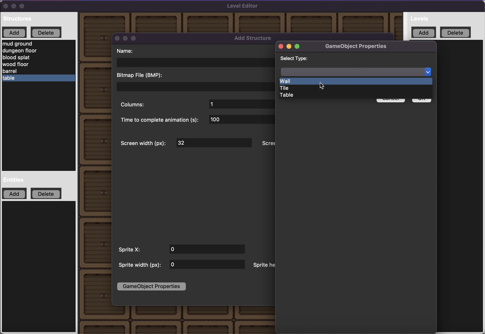
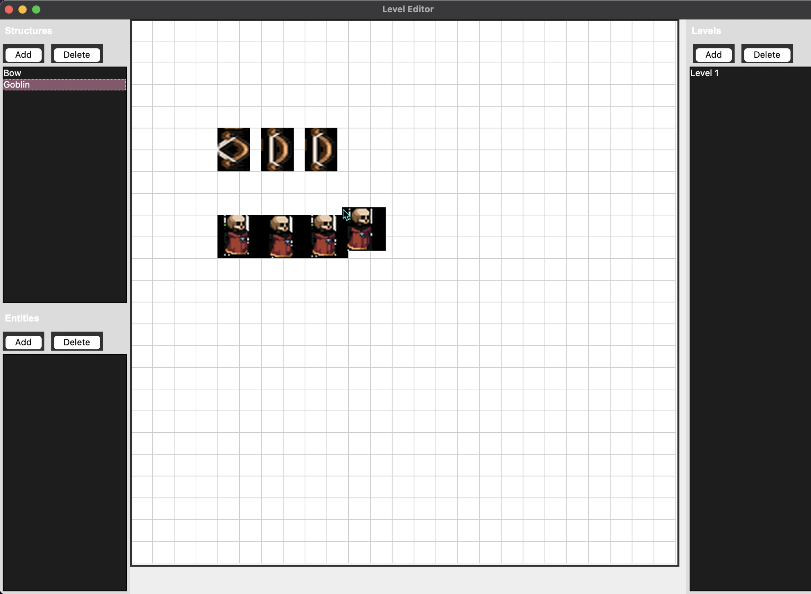

# The Table Engine

Welcome to [The Table Engine](https://kli63.github.io/EngineDocs/), a custom-built game engine designed to streamline the creation of 2D games. This project was developed collaboratively by Arnav Narula, Kenny Li, Jeffrey Lin, and Buwei Chen.

## Features

- **GameObject Creation**: Design unique structures and entities with ease.
- **Bitmap Import and Animation**: Import bitmap files, animate them, and adjust settings with real-time previews.
- **Animation Segmentation**: Utilize bitmap segments for dynamic animations.
- **Property Editing**: Modify game object properties through intuitive popups, with auto-population based on selected types.
- **Custom Collision Logic**: Define and customize collision behaviors.
- **Configuration Integration**: Generate types and fields from configuration files.
- **Map and Level Design**: Create maps and levels with preview images and snap grids.
- **Seamless Mode Switching**: Effortlessly toggle between level editing and gameplay modes.

## Screenshots

## Download and Compilation Instructions

To get started with The Table Engine:

1. **Download**: Clone the repo
2. **Navigate**: Open a terminal and navigate to the project's root directory.
3. **Compile**:
   - Change directory: `cd Engine`
   - Make the script executable: `chmod +x run.sh`
   - Run the script: `./run.sh`
4. **Launch**: Use the GUI to load the demo or start creating your own game.
